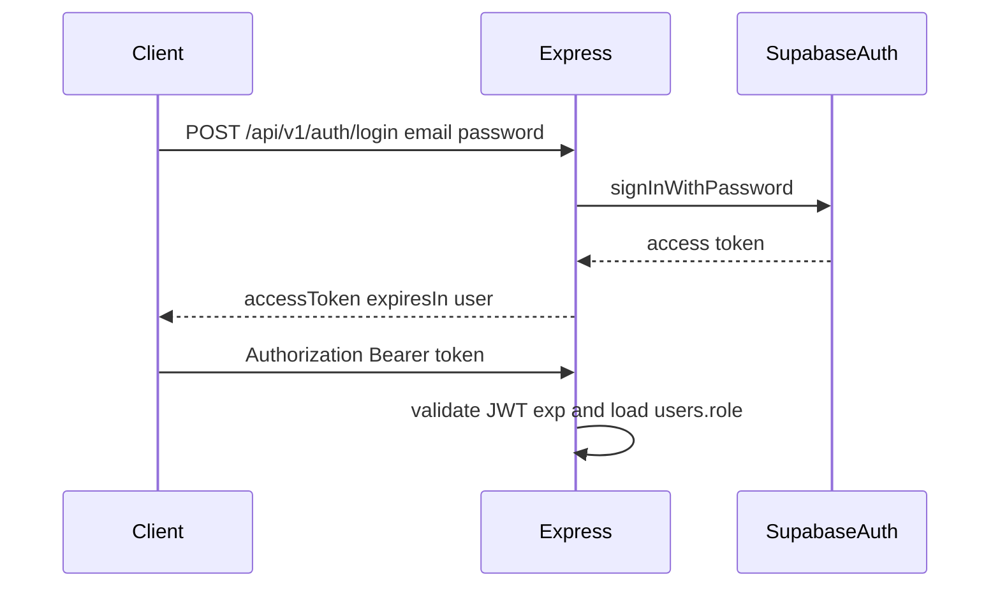

# Authentication flow

## Confirmed (AUTH-10)

The system shall provide email-and-password authentication. Session expiry, password management, and account provisioning **shall be defined**. Values are **not defined**.

Three roles exist: employee, admin, guest admin (AUTH-09). Separate Employee vs HR/Admin capabilities (AUTH-01).

## Implemented today

`mobile/services/auth.ts`: delay + mock token. Login screen validates email contains `@`. Session is discarded. `getSession()` returns `null`. Dev “Pass” bypass exists. No backend verification.

## Proposed flow (unsigned)

Proposed endpoints: login, refresh, logout (204), forgot-password (204 always — TD), update-password, `/auth/me`.

Provisioning: admin `POST /employees` creates Auth user + `users` + `employees`. Invite email recommended (TD-15), requires confirmation. First admin created out-of-band.

Session TTL: TBD. Pack recommendation ~1 hour access token (TD-16), requires confirmation.

No SSO / external IdP in current requirements.

## Authorization

Confirmed: employees own-data only; HR/Admin org-wide; medical documents HR/Admin (and Proposed: guest_admin read). Enforce **server-side**. Never trust a client-supplied role.

Proposed: 401 unauthenticated; 403 authenticated but not permitted; employee accessing another UUID → 404 (TD, requires confirmation).

See `documentation/features/auth-and-roles.md` and `documentation/security/model.md`.
