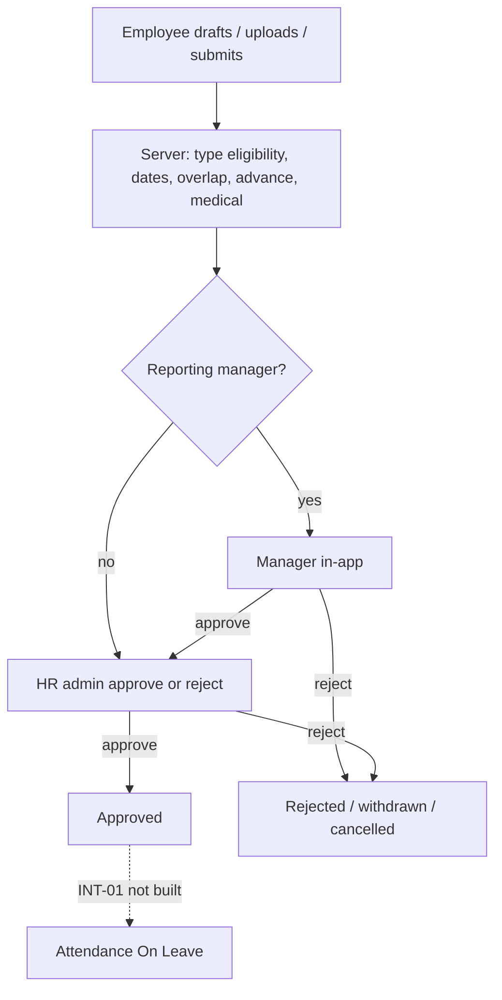
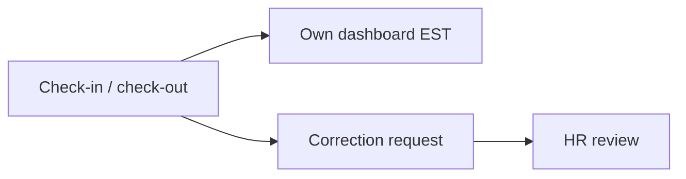

# Whole-app flow and journey

How people move through the product, what each step does, and what is in the repo today. This is **not** a signed wireframe. **Confirmed** rules vs **Proposed** mapping are labelled. Detail lives in feature files; this is the map.

**UI today:** Expo splash → mock login → Home / Profile / Settings placeholders. Domain screens are not built. Journeys below are **API + product intent**. The mobile app does not yet call these APIs.

```text
Client (Expo, not wired)     Express /api/v1              PostgreSQL (Prisma)
        |                          |                              |
        |     JWT Bearer           |  leave-management            |
        |---------------------->   |  attendance-management       |
                                   |  shared (auth, people, org)  |
```

---

## 1. Who uses it

| Role | Job | Access |
| --- | --- | --- |
| `employee` | Apply for **own** leave; punch **own** attendance; request corrections | Own data only (AUTH-02/03). No org dashboard. No medical download (MED-09). |
| `admin` | Directory, leave review, org attendance, medical, reports, config | Org-wide read + mutations (AUTH-04/05). |
| `guest_admin` | Same **views** as admin | **Proposed:** org-wide **GET** only; writes 403. Audit viewer likely admin-only (AUD-08 Open). |

Roles are Confirmed (AUTH-09). The guest = read-only matrix is **Proposed**.

---

## 2. Sign-in (how identity works)

**API implemented.** Email/password (AUTH-10 Confirmed; TTL/provisioning Open).

1. `POST /api/v1/auth/login` — bcrypt + pepper; returns access token, refresh token, user (id, email, role). Login is rate-limited.
2. Later calls send `Authorization: Bearer <access>`. Server loads role from the token/DB — **never** from the client body.
3. `POST /auth/refresh` rotates the refresh token. `POST /auth/logout` ends the session. `GET /auth/me` is the current user + employee.
4. Forgot/reset password and change-password exist on the API. Forgot always looks like success (no email enumeration).

**Mobile today:** mock login, token discarded, no route guard, “Pass” bypass. Splash always goes to login.

Inactive users cannot use the system. First admin is provisioned out-of-band (**Proposed**). No SSO.

---

## 3. Org setup (admin, before day-to-day work)

These APIs exist. They feed leave day-count and (later) attendance.

| Piece | What it is | Who writes |
| --- | --- | --- |
| Departments | Teams employees belong to (Prisma requires `departmentId`) | Admin create/update |
| Employees | Name, email, role, department, manager, sex (maternity eligibility), status | Admin create/patch; guest **GET** |
| Leave types | Casual, Sick, etc.; medical flag; `allowedSex` | Admin CRUD; all roles **GET** |
| Leave policies | Per-type medical-after-N-days, weekend/holiday flags, max days | Admin write; all **GET** |
| Holidays + org settings | Holiday calendar; timezone EST; weekly offs; work hours; advance window (default 14 days); medical 1–2 day optionality | Admin write (**RBAC on holidays/settings still incomplete** in code) |

Employees with **no manager** skip manager review (LV-WF-13). Employees with **no department** are allowed in the BRD; live Prisma currently requires a department.

---

## 4. Employee journey — leave

**HTTP implemented.** No leave screens on mobile yet.

```text
Draft (optional) → attach files → Submit
        → if manager: SUBMITTED (manager pending)
        → if no manager: PENDING_HR_REVIEW
        → HR/Admin own leave: auto APPROVED
Manager approve → PENDING_HR_REVIEW
Manager reject → REJECTED
HR approve → APPROVED     HR reject → REJECTED
Owner withdraw / cancel (rules for already-approved cancel are Open)
```

**What the employee does**

1. Prefill name / department / manager when present.
2. Choose leave type (must be eligible, e.g. maternity vs `sex`).
3. Pick dates as **sessions**: full day, first half, second half (can mix — “zigzag”). Server derives start/end and day count. Weekends/holidays included or excluded from **policy**, not sandwich-filled as leave (CAL-07).
4. Reason required. Cannot overlap `SUBMITTED` / `PENDING_HR_REVIEW` / `APPROVED`. Cannot apply beyond org `maxAdvanceDays`.
5. **Medical:** if the type requires a document and duration crosses the policy threshold, upload PDF/JPG/JPEG/PNG on the **draft** (`POST /documents`), then submit. Missing mandatory file → `MEDICAL_DOCUMENT_REQUIRED`. Employees **cannot download medical** files; they may GET own **non-medical** files (**Proposed**).
6. Save draft (`POST /leaves/drafts`, `PATCH` draft) or submit (`POST /leaves` or `POST /leaves/:id/submit`). Immediate submit cannot attach a file in the same request.

**What happens after submit**

- Status history is recorded (`GET /leaves/:id/history`).
- **Approved leave → attendance On Leave** (INT-01) is **Confirmed** but **not implemented**. If punches already exist, do **not** overwrite — raise a correction (INT-03), also not implemented.
- Notifications (submit / approve / reject / missing medical) are Confirmed events, **not implemented**.

List: employees see **own** leaves; admin and guest_admin see org-wide.

---

## 5. Manager journey — leave (in-app)

**Implemented on the API** (product plan). Original BRD/ADR-0004 said manager approval is **outside** the app; live code uses in-app approve/reject.

- Only the **reporting manager** on that application: `POST /leaves/:id/manager-approve` or `manager-reject`.
- Approve moves `SUBMITTED` → `PENDING_HR_REVIEW`. Reject ends the request.
- Managers are **not** HR: they do not get the org dashboard or medical download unless they also have admin/guest role.

---

## 6. Admin journey — leave review and directory

**Leave review (API implemented)**

- List/detail org leaves; read history; **GET medical documents**.
- `POST /leaves/:id/approve` or `reject` while status is `PENDING_HR_REVIEW`. Admin **cannot** manually approve **own** leave (auto-approved on submit).
- Cancel: owner or admin (who may cancel **approved** leave is Open).

**Directory**

- Create/update/deactivate employees and departments.
- Guest admin: list/get only.

**Config** — leave types, policies, holidays, org settings (see §3).

---

## 7. Guest admin journey

Same **screens/data** as admin for **reading**: HR snapshot (when built), org leave, org attendance, medical download, reports, employee list, config **GET**.

**Does not:** create people, change config, approve/reject leave or corrections, upload for others, PATCH attendance. Mutations → 403.

---

## 8. Employee journey — attendance (**not implemented**)

Confirmed intent (AT-01–05, dashboards in EST):

1. Check-in stores **date + exact time** on the employee (server clock Proposed, not device).
2. Check-out closes that day. Duplicate punch / out-without-in is **Proposed**; stakeholder note: **disable buttons** instead.
3. Own dashboard: today, in/out, monthly present / absent / leave, late, missing checkout.
4. Employee **cannot PATCH** days (BR-10). Wrong punch → **correction request**; HR approves/rejects times.

**HR attendance (not implemented):** org list; HR dashboard counts (employees, present, on leave, absent, unmarked, late, missing checkout, pending leave) in EST; optional direct edit vs request-only — **Conflict** (ADR-0007). Do not invent a stored “Unauthorized Absence”.

---

## 9. Reports, notifications, audit (**not implemented**)

- **Reports (AUTH-07):** leave (employee, department, monthly, type, decisions) and attendance (daily, monthly, employee, late, missing-logout). Excel / CSV / PDF. Pack: admin **and** guest_admin (REP-15 Open).
- **Notifications:** in-app (and Proposed email) for leave decisions, missing medical before submit, unmarked attendance, missing logout. Own list only. Teams/Slack is Future.
- **Audit (BR-12 Confirmed):** every change recorded. Viewer **Proposed** admin-only. Must not log passwords or medical bytes.

---

## 10. End-to-end pictures

### Leave (working API path)



### Attendance (target; APIs not built)



### HR day (target UI)

Login as admin or guest → **HR dashboard** (counts) → drill into leave queue, attendance, medical, reports. Admin continues to **act**; guest **only looks**.

---

## 11. What this product does not include

Leave balances, overtime, payroll, SSO, multi-tenant `org_id`, sandwich-fill weekends as leave, manager **HR** dashboards, Teams/Slack. See `documentation/features/out-of-scope.md`.

---

## Related files

- Roles: `documentation/features/auth-and-roles.md`
- Leave: `leave-application.md`, `leave-workflow.md`, `medical-documents.md`
- Attendance: `attendance.md`, `attendance-correction.md`, `leave-attendance-integration.md`
- HR UI intent: `documentation/ui/implied-surfaces.md`, `features/hr-dashboard.md`
- Auth sequence (stale vs live JWT): `documentation/architecture/authentication-flow.md`
- Older rule-level flows: `documentation/architecture/data-flows.md`

## Change History

2026-09-09 — Added whole-app journey: roles, auth, leave (as implemented), attendance/reports as planned, guest-admin split.
