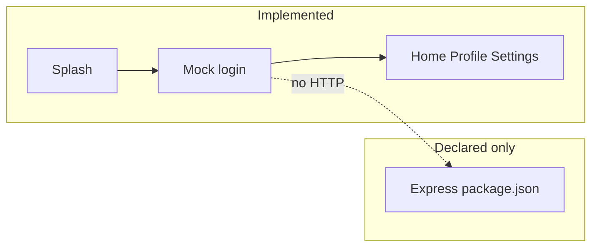

# System overview

## Status of this document

Describes **what exists in the repository** and separately the **Proposed** engineering target. The target is not implemented and not business-signed.

## Implemented

```text
leave-attendance-system/
  mobile/     Expo SDK 54 app (UI shell)
  backend/    Express 5 package.json only (no server)
  documentation/   this OS
```



- Navigation: Expo Router stack + tabs. See `documentation/ui/current-mobile.md`.
- Auth: client mock; tokens not stored; tabs not guarded.
- Database, storage, real API: absent.

## Proposed target (unsigned)

HTTPS client → Express (TypeScript in the pack; **repo is CommonJS JS** — see ADR-0001) → validation → JWT → RBAC → domain services → repositories → Supabase PostgreSQL + Auth + Storage.

Base path `/api/v1`. Private bucket `leave-documents`. Environments: separate Supabase projects for local/staging/production.

**Conflict:** the pack described a web client and called mobile apps out of scope. This repository’s only UI is Expo. Keep Expo until ADR-0005 is approved otherwise.

## Module boundaries (Proposed names, not existing folders)

`auth`, `employees`, `leave`, `attendance`, `calendar`, `documents`, `notifications`, `reports`, `audit`, `config`.

Do not add leave-balance, overtime, or payroll modules.

## Important constraints

- Single organization timezone; no `org_id` multi-tenant in v1.
- Manager leave approval is **outside** the application (BR-15). No manager-approve API.
- Complex rules belong in Express, not only in the browser and not only in RLS.
