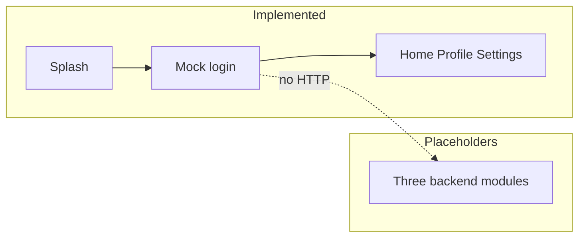

# System overview

## Status of this document

Describes **what exists in the repository** and separately the **Proposed** engineering target. The target is not implemented and not business-signed.

## Implemented

```text
leave-attendance-system/
  mobile/          Expo SDK 54 app (UI shell)
  backend/         Express + Prisma (`/api/v1` departments & employees)
    src/
      index.ts, app.ts, env.ts, logger.ts
      generated/prisma/     Prisma client output
      modules/
        leave-management/
        attendance-management/
        shared/
  documentation/   this OS
```

Domain route/service/repository files exist; **departments and employees are implemented**. Other features are structural placeholders. Prisma schema and init migration exist. See [ADR-0008](../decisions/ADR-0008-three-backend-modules.md).



- Navigation: Expo Router stack + tabs. See `documentation/ui/current-mobile.md`.
- Auth: client mock; tokens not stored; tabs not guarded.
- Prisma schema + init migration. HTTP APIs implemented for departments and employees only (`/api/v1`). Other domain routes remain placeholders.

## Proposed target (unsigned)

HTTPS client → Express (TypeScript in the pack; **repo is CommonJS JS** — see ADR-0001) → validation → JWT → RBAC → domain services → repositories → Supabase PostgreSQL + Auth + Storage.

Base path `/api/v1`. Private bucket `leave-documents`. Environments: separate Supabase projects for local/staging/production.

**Conflict:** the pack described a web client and called mobile apps out of scope. This repository’s only UI is Expo. Keep Expo until ADR-0005 is approved otherwise.

## Module boundaries

**In repo (folder layout, ADR-0008):**

- `leave-management` — leave types, policies, applications, documents.
- `attendance-management` — attendance, attendance corrections.
- `shared` — auth, employees, departments, holidays, organisation settings, notifications, audit, reports, health, database, middleware, types, utilities, leave–attendance integration.

Pack names (`auth`, `employees`, `leave`, `attendance`, `calendar`, `documents`, `notifications`, `reports`, `audit`, `config`) map into those three modules. They are not separate top-level packages.

Do not add leave-balance, overtime, or payroll modules.

## Important constraints

- Single organization timezone; no `org_id` multi-tenant in v1.
- Manager leave approval is **outside** the application (BR-15). No manager-approve API.
- Complex rules belong in Express, not only in the browser and not only in RLS.

## HTTP errors (implemented)

All JSON errors come from `backend/src/modules/shared/middlewares/error.middleware.ts`, registered last in `app.ts` (after `notFoundMiddleware`). Envelope: `{ error: { code, message, details? } }`.

- Services throw `HttpError` (404/409/422). Controllers use `asyncHandler` and do not write error bodies.
- Zod failures from `validate` are `ZodError` → 422 `VALIDATION_ERROR`.
- Prisma `P2002` → 409 (`EMAIL_IN_USE` or `CONFLICT`); `P2003` → 422; `P2025` → 404.
- Invalid JSON body → 400 `INVALID_JSON`. Unknown errors → 500 `INTERNAL_ERROR` (logged; no stack in the response).
