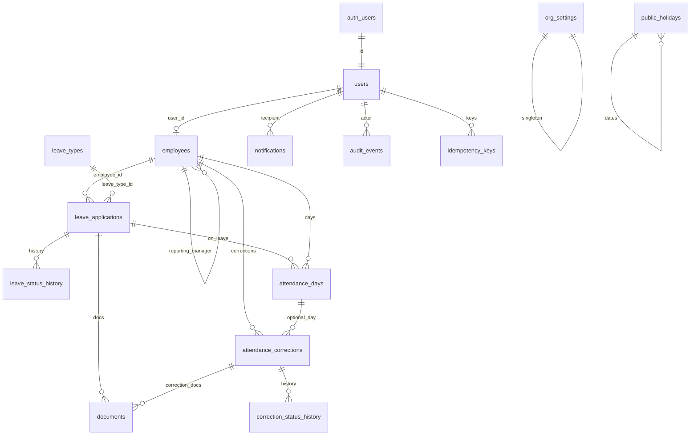

# ERD (Proposed)

Cardinalities from the engineering pack. Not implemented.

`org_settings` and `public_holidays` have no FK to employees.

## FK on delete (Proposed)

- `employees.user_id` RESTRICT
- manager SET NULL
- leave employee/type RESTRICT
- `attendance_days.leave_application_id` SET NULL
- documents SET NULL or RESTRICT if attached
